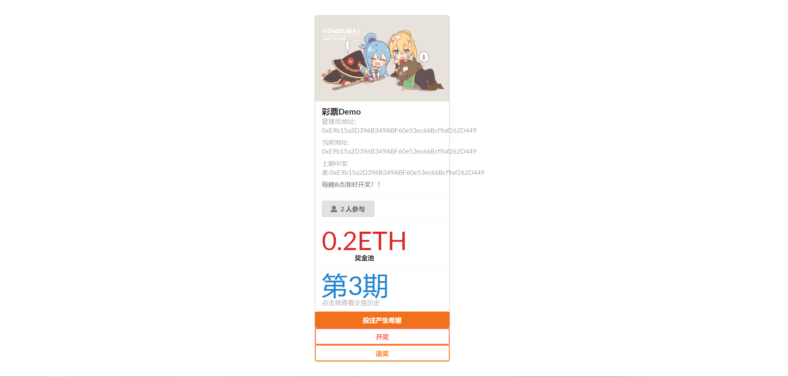

# lottery-eth

## Pre-installed

- Node V14

## How to run

Install yarn:

```shell
$ npm install -g yarn
```

First, clone the repository:

```shell
$ git clone https://github.com/SherLzp/lottery-eth.git
```

Install dependencies:

```shell
$ cd lottery-eth
$ yarn install
```

Start:

```shell
$ yarn start
```

Then, you will see the page:



